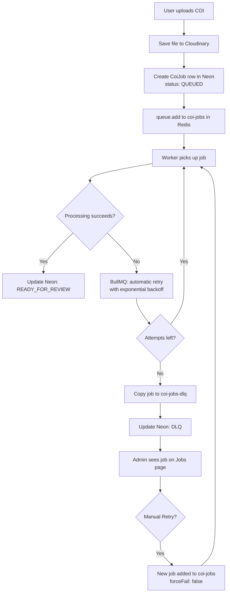

# DLQ, BullMQ & Redis — How It Works

Simple guide to how COI job processing, automatic retries, dead letter queue (DLQ), and manual retries work in this project.

---

## The big picture (30-second version)

1. You **upload a COI** → the app saves the file and drops a **job** into the **`coi-jobs`** queue in **Redis**.
2. A **worker** (`npm run worker`) picks up the job and tries to process it.
3. If processing **fails**, BullMQ **automatically retries** (with delays between tries).
4. After **all retries are used up**, the job is **copied to the DLQ queue** (`coi-jobs-dlq`) and marked **DLQ** in the database.
5. An admin can **manually retry** from the dashboard → a **new job** goes back to `coi-jobs`.

**Redis** = the shared mailbox where queues live.  
**BullMQ** = the library that manages queues, workers, retries, and delays.  
**Neon (Postgres)** = where we store job status for the UI (Queued, Failed, DLQ, etc.).

---

## What each piece does

| Piece | Role | Analogy |
|-------|------|---------|
| **Redis (Upstash)** | Stores queue data: waiting jobs, delayed retries, failed jobs | Post office sorting room |
| **BullMQ `Queue`** | Adds jobs to a named queue (`coi-jobs`, `coi-jobs-dlq`) | Mailbox labeled "COI inbox" |
| **BullMQ `Worker`** | Pulls jobs from a queue and runs your code | Clerk who reads the inbox and does the work |
| **`coi-jobs` queue** | Main work queue — all new COI processing starts here | Normal inbox |
| **`coi-jobs-dlq` queue** | Dead letter queue — copy of jobs that failed permanently | "Problem" pile for human review |
| **Neon `CoiJob` table** | Status the dashboard shows (Queued, Processing, Failed, DLQ, Ready for Review) | Spreadsheet the UI reads |
| **Next.js app** | Upload API enqueues jobs; dashboard shows status; retry button calls API | Front desk |

---

## Queues in this project

Configured in `.env`:

```env
BULLMQ_COI_QUEUE=coi-jobs-local      # main queue (use -local suffix for dev on shared Redis)
BULLMQ_COI_DLQ=coi-jobs-local-dlq    # dead letter queue
JOB_MAX_ATTEMPTS=5                   # automatic retries (default)
JOB_BACKOFF_DELAY_MS=5000            # base delay for exponential backoff
```

| Queue name | Used when | Worker listens? |
|------------|-----------|-----------------|
| `coi-jobs` (or `coi-jobs-local`) | Every COI upload or email intake | **Yes** — `npm run worker` |
| `coi-jobs-dlq` | After all automatic retries fail | **No** — storage + inspection only (Phase 2) |
| `reminder-jobs` | Phase 6 — expiry reminders | Not yet |
| `reminder-jobs-dlq` | Phase 6 — failed reminders | Not yet |

BullMQ does **not** have a built-in DLQ. We implement it by **copying** the failed job into a second queue when retries are exhausted.

---

## End-to-end workflow



---

## Step-by-step: from upload to finish

### 1. Enqueue (Next.js API)

**File:** `app/api/coi/route.ts` → `createCoiFromUploadWithJob()` → `createProcessCoiJob()`

1. COI file uploaded → stored in Cloudinary.
2. Row created in `CoiDocument` (compliance status: Pending Review).
3. Row created in `CoiJob` (job status: **Queued**).
4. BullMQ job added to Redis queue `coi-jobs`:

```ts
queue.add("process-coi", {
  coiJobId: "...",
  coiDocumentId: "...",
  forceFail?: true   // only when WORKER_FORCE_FAIL=true (DLQ testing)
}, {
  jobId: coiJobId,
  attempts: 5,
  backoff: { type: "exponential", delay: 5000 }
})
```

Job data and options live in **Redis**. Neon only stores the `CoiJob` row for the UI.

### 2. Worker processes (BullMQ Worker)

**File:** `lib/workers/coi-worker.ts` + `lib/workers/process-coi.ts`

1. Worker connects to Redis and listens on `BULLMQ_COI_QUEUE`.
2. When a job is available, worker runs:
   - `markJobProcessing` → Neon status: **Processing**
   - `handleProcessCoiJob` → stub: wait 1.5s, then **Ready for Review** (or throw error)
3. If the handler **throws**, BullMQ marks the job failed and schedules a retry.

### 3. Automatic internal retries (BullMQ — no human involved)

**Configured in:** `lib/queue/job-options.ts`  
**Handled by:** BullMQ inside Redis (not our code during the retry delay)

When processing throws an error:

1. BullMQ fires the worker `failed` event.
2. Our handler updates Neon to **Failed** (temporary — more tries may come).
3. If `attemptsMade < maxAttempts`, BullMQ **re-queues** the job after a **delay**.
4. Delay uses **exponential backoff**:
   - Base: `JOB_BACKOFF_DELAY_MS` (e.g. 5000 ms)
   - Attempt 2: ~5 s later
   - Attempt 3: ~10 s later
   - Attempt 4: ~20 s later
   - (formula: `delay × 2^(attempt-1)`)

Example with `JOB_MAX_ATTEMPTS=2` and `JOB_BACKOFF_DELAY_MS=1000`:

| Attempt | Result | Neon status | What happens next |
|---------|--------|---------------|-------------------|
| 1 | Fail | Failed | Wait ~1 s, retry |
| 2 | Fail | **DLQ** | Copied to `coi-jobs-dlq` |

We do **not** write retry scheduling logic ourselves — BullMQ stores the delayed job in Redis and re-delivers it to the worker when the delay expires.

### 4. Moving to DLQ (after retries exhausted)

**File:** `lib/queue/dlq-handler.ts`  
**Triggered by:** `worker.on("failed")` in `coi-worker.ts`

When `attemptsMade >= maxAttempts`:

1. Job payload is **copied** to `coi-jobs-dlq` with id `dlq-{coiJobId}`.
2. Extra metadata added: `failureReason`, `failedAt`, `originalBullmqJobId`.
3. Neon `CoiJob` updated:
   - `status` → **DLQ**
   - `attempts` → final count
   - `failureReason` → error message
   - `dlqJobId` → id in DLQ queue

The original job remains in BullMQ’s failed set on the main queue (`removeOnFail: false`). The DLQ queue holds a **copy** for inspection and audit.

### 5. Manual retry (admin clicks Retry)

**UI:** `/dashboard/jobs` → Dead letter queue → **Retry** button  
**API:** `POST /api/jobs/dlq/[id]/retry`  
**Logic:** `retryJobFromDlq()` in `lib/services/jobs.ts`

1. Validates job status is **DLQ**.
2. Creates a **new** BullMQ job on `coi-jobs` with a fresh id: `{coiJobId}-retry-{timestamp}`.
3. Passes `forceFail: false` so test mode does not re-fail the job.
4. Resets Neon row:
   - `status` → **Queued**
   - `attempts` → 0
   - `failureReason` → null
   - `dlqJobId` → null
5. Worker picks up the new job and processes normally.

Manual retry does **not** re-use the old BullMQ job — it enqueues a **brand new** one.

---

## How Redis, BullMQ, and Neon interact

```
┌─────────────────┐     enqueue      ┌──────────────────────────────┐
│   Next.js API   │ ───────────────► │  Redis (Upstash)             │
│   (upload)      │                  │  • coi-jobs: waiting/active  │
└─────────────────┘                  │  • coi-jobs-dlq: failed copy │
        │                            │  • delayed retry keys        │
        │ write CoiJob               └──────────────┬───────────────┘
        ▼                                           │
┌─────────────────┐                                 │ poll
│  Neon Postgres  │ ◄── status updates ─────────────┤
│  CoiJob table   │                                 │
└─────────────────┘                                 ▼
        ▲                                  ┌─────────────────┐
        │ read for UI                      │  BullMQ Worker  │
        │                                  │  npm run worker │
┌─────────────────┐                        └─────────────────┘
│   Dashboard     │
│   /dashboard    │
│   /dashboard/jobs
└─────────────────┘
```

- **Redis** = source of truth for *queue mechanics* (what to run, when to retry).
- **Neon** = source of truth for *what the UI shows* (we sync on each state change).
- **Worker** = bridge between Redis jobs and Neon status updates.

---

## Job status reference (Neon `CoiJob.status`)

| Status | Meaning |
|--------|---------|
| **Queued** | In Redis `coi-jobs`, waiting for worker |
| **Processing** | Worker is running `handleProcessCoiJob` |
| **Failed** | Last attempt failed, but BullMQ will retry |
| **DLQ** | All retries used; copy in `coi-jobs-dlq` |
| **Ready for Review** | Processing succeeded (stub complete; AI review in Phase 4) |

The main dashboard **Job status** column reads the latest `CoiJob` for each document.

---

## DLQ testing mode

For local testing only:

```env
WORKER_FORCE_FAIL=true
JOB_MAX_ATTEMPTS=2
JOB_BACKOFF_DELAY_MS=1000
BULLMQ_COI_QUEUE=coi-jobs-local
BULLMQ_COI_DLQ=coi-jobs-local-dlq
```

- Every new upload gets `forceFail: true` baked into the job data in Redis.
- Worker always throws → automatic retries → DLQ.
- Use **unique local queue names** on shared Upstash so another worker does not steal jobs.

**Automated test:**

```powershell
npm run worker    # terminal 1
npm run test:dlq  # terminal 2 — should print "DLQ test PASSED"
```

Turn off when done:

```env
WORKER_FORCE_FAIL=false
```

---

## Key source files

| File | Purpose |
|------|---------|
| `lib/queue/coi-queue.ts` | Create queues, enqueue jobs |
| `lib/queue/job-options.ts` | `attempts`, exponential `backoff` |
| `lib/queue/dlq-handler.ts` | Move exhausted jobs to DLQ |
| `lib/queue/connection.ts` | Redis URL for BullMQ |
| `lib/workers/coi-worker.ts` | Worker + `failed` event listener |
| `lib/workers/process-coi.ts` | Actual processing logic |
| `lib/services/jobs.ts` | Create job, list DLQ, manual retry |
| `scripts/worker.ts` | Worker entrypoint |
| `scripts/test-dlq.ts` | Automated DLQ test |

---

## Official BullMQ references

- [Workers](https://docs.bullmq.io/guide/workers)
- [Retrying failing jobs](https://docs.bullmq.io/guide/retrying-failing-jobs)
- [Job options](https://docs.bullmq.io/guide/jobs/job-options)

---

## FAQ

**Q: Does the DLQ queue have its own worker?**  
A: Not in Phase 2. Jobs sit in `coi-jobs-dlq` for inspection. Retry re-enqueues to `coi-jobs`.

**Q: Why both Redis and Neon?**  
A: Redis is fast for queues and retries. Neon is persistent and easy to query for the dashboard.

**Q: What if the worker is not running?**  
A: Jobs stay **Queued** in Redis. Nothing processes until `npm run worker` is running.

**Q: Why use `coi-jobs-local` in dev?**  
A: Shared Upstash Redis may have another worker on `coi-jobs` that steals your jobs. A unique queue name isolates your local environment.
